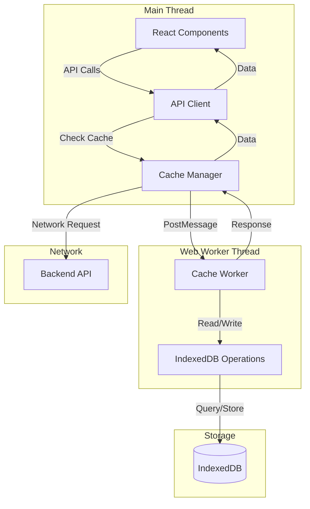
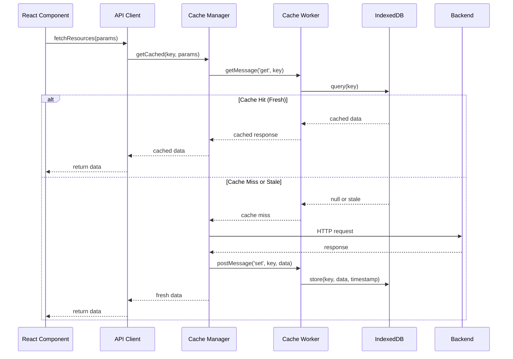
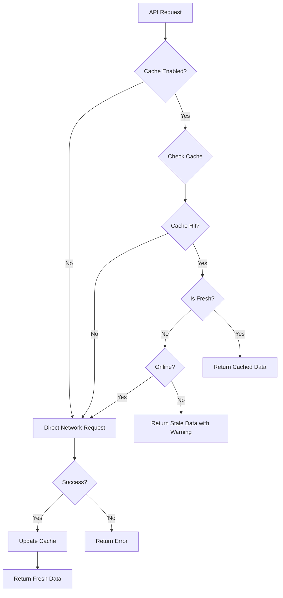

# Design Document: Frontend Request Caching

## Overview

This design implements a comprehensive frontend caching system for the Douyin Media Gallery application using Web Workers and IndexedDB. The system offloads cache operations to a background thread, stores API responses persistently, and provides intelligent cache invalidation strategies to improve performance and enable offline browsing.

The architecture follows a layered approach:
1. **API Client Layer**: Enhanced existing API client with cache-aware request handling
2. **Cache Manager Layer**: Coordinates caching logic and worker communication
3. **Web Worker Layer**: Executes cache operations in background thread
4. **Storage Layer**: IndexedDB for persistent data storage

## Architecture

### High-Level Architecture



### Component Interaction Flow



### Cache Decision Tree



## Components and Interfaces

### 1. Cache Manager (`web/src/cache/CacheManager.ts`)

The Cache Manager coordinates all caching operations and manages communication with the Web Worker.

**Responsibilities:**
- Initialize and manage Web Worker lifecycle
- Generate cache keys from requests
- Coordinate cache reads and writes
- Handle request deduplication
- Manage cache invalidation
- Track cache statistics

**Interface:**

```typescript
interface CacheManagerConfig {
  workerPath: string;
  staleTresholds: Record<string, number>;
  cacheVersion: number;
  enableLogging: boolean;
}

interface CacheEntry<T = any> {
  data: T;
  timestamp: number;
  version: number;
  key: string;
}

interface CacheStats {
  hits: number;
  misses: number;
  totalEntries: number;
  storageSize: number;
  hitRate: number;
}

class CacheManager {
  constructor(config: CacheManagerConfig);
  
  // Core cache operations
  async get<T>(key: string): Promise<CacheEntry<T> | null>;
  async set<T>(key: string, data: T): Promise<void>;
  async delete(key: string): Promise<void>;
  async clear(): Promise<void>;
  
  // Cache key generation
  generateKey(endpoint: string, params?: Record<string, any>): string;
  
  // Invalidation
  async invalidate(pattern: string | RegExp): Promise<void>;
  async invalidateAll(): Promise<void>;
  
  // Statistics
  getStats(): CacheStats;
  resetStats(): void;
  
  // Lifecycle
  terminate(): void;
}
```

### 2. Cache Worker (`web/src/cache/cacheWorker.ts`)

The Web Worker handles all IndexedDB operations in a background thread.

**Responsibilities:**
- Open and manage IndexedDB connection
- Execute CRUD operations on cache entries
- Handle schema migrations
- Manage storage quota
- Process messages from main thread

**Message Protocol:**

```typescript
type WorkerMessageType = 
  | 'init'
  | 'get'
  | 'set'
  | 'delete'
  | 'clear'
  | 'invalidate'
  | 'stats'
  | 'cleanup';

interface WorkerMessage {
  id: string;
  type: WorkerMessageType;
  payload?: any;
}

interface WorkerResponse {
  id: string;
  success: boolean;
  data?: any;
  error?: string;
}

// Worker message handlers
self.addEventListener('message', (event: MessageEvent<WorkerMessage>) => {
  const { id, type, payload } = event.data;
  
  switch (type) {
    case 'init':
      handleInit(id, payload);
      break;
    case 'get':
      handleGet(id, payload);
      break;
    case 'set':
      handleSet(id, payload);
      break;
    case 'delete':
      handleDelete(id, payload);
      break;
    case 'clear':
      handleClear(id);
      break;
    case 'invalidate':
      handleInvalidate(id, payload);
      break;
    case 'stats':
      handleStats(id);
      break;
    case 'cleanup':
      handleCleanup(id, payload);
      break;
  }
});
```

### 3. IndexedDB Schema (`web/src/cache/schema.ts`)

**Database Structure:**

```typescript
const DB_NAME = 'douyin-cache';
const DB_VERSION = 1;
const STORE_NAME = 'api-cache';

interface CacheRecord {
  key: string;           // Primary key
  endpoint: string;      // Indexed
  data: any;            // Response data
  timestamp: number;    // Indexed for cleanup
  version: number;      // Cache version
  size: number;         // Approximate size in bytes
}

// IndexedDB Schema
const schema = {
  stores: [
    {
      name: STORE_NAME,
      keyPath: 'key',
      indexes: [
        { name: 'endpoint', keyPath: 'endpoint', unique: false },
        { name: 'timestamp', keyPath: 'timestamp', unique: false },
        { name: 'version', keyPath: 'version', unique: false }
      ]
    }
  ]
};
```

### 4. Enhanced API Client (`web/src/api.ts`)

The existing API client is enhanced with cache-aware request handling.

**Enhanced Interface:**

```typescript
interface RequestOptions {
  cache?: boolean;           // Enable caching for this request
  cacheKey?: string;         // Custom cache key
  staleTreshold?: number;    // Override default stale threshold
  forceRefresh?: boolean;    // Bypass cache and fetch fresh
}

interface CachedResponse<T> {
  data: T;
  cached: boolean;
  stale: boolean;
  timestamp?: number;
}

// Enhanced API functions
async function fetchResources(
  params: ResourceParams,
  options?: RequestOptions
): Promise<CachedResponse<ResourceResponse>>;

async function fetchAuthors(
  options?: RequestOptions
): Promise<CachedResponse<Author[]>>;

async function fetchTags(
  options?: RequestOptions
): Promise<CachedResponse<Tag[]>>;

async function fetchConfig(
  options?: RequestOptions
): Promise<CachedResponse<Config>>;
```

**Cache Integration Pattern:**

```typescript
async function cachedFetch<T>(
  url: string,
  options: RequestOptions = {}
): Promise<CachedResponse<T>> {
  const {
    cache = true,
    cacheKey,
    staleTreshold,
    forceRefresh = false
  } = options;
  
  if (!cache || forceRefresh) {
    const data = await directFetch<T>(url);
    return { data, cached: false, stale: false };
  }
  
  const key = cacheKey || cacheManager.generateKey(url, options);
  const cached = await cacheManager.get<T>(key);
  
  if (cached && !isStale(cached, staleTreshold)) {
    return {
      data: cached.data,
      cached: true,
      stale: false,
      timestamp: cached.timestamp
    };
  }
  
  // Fetch fresh data
  const data = await directFetch<T>(url);
  await cacheManager.set(key, data);
  
  return { data, cached: false, stale: false };
}
```

### 5. Request Deduplication (`web/src/cache/RequestDeduplicator.ts`)

Prevents concurrent requests for the same resource.

**Interface:**

```typescript
class RequestDeduplicator {
  private pending: Map<string, Promise<any>>;
  
  async deduplicate<T>(
    key: string,
    fetcher: () => Promise<T>
  ): Promise<T>;
  
  clear(key: string): void;
  clearAll(): void;
}
```

**Implementation Strategy:**

```typescript
async deduplicate<T>(key: string, fetcher: () => Promise<T>): Promise<T> {
  // Check if request is already in-flight
  if (this.pending.has(key)) {
    return this.pending.get(key) as Promise<T>;
  }
  
  // Create new request
  const promise = fetcher()
    .finally(() => {
      this.pending.delete(key);
    });
  
  this.pending.set(key, promise);
  return promise;
}
```

### 6. Cache Invalidation Service (`web/src/cache/InvalidationService.ts`)

Manages cache invalidation strategies.

**Interface:**

```typescript
class InvalidationService {
  constructor(private cacheManager: CacheManager);
  
  // Invalidation triggers
  async onReindex(): Promise<void>;
  async onConfigUpdate(): Promise<void>;
  async onMediaDelete(ids: string[]): Promise<void>;
  async onManualClear(): Promise<void>;
  
  // Pattern-based invalidation
  async invalidateByEndpoint(endpoint: string): Promise<void>;
  async invalidateByPattern(pattern: RegExp): Promise<void>;
}
```

**Invalidation Patterns:**

```typescript
// Invalidation rules
const INVALIDATION_RULES = {
  reindex: [
    /^\/api\/resources/,
    /^\/api\/authors/,
    /^\/api\/tags/
  ],
  configUpdate: [
    /^\/api\/config/
  ],
  mediaDelete: (ids: string[]) => [
    /^\/api\/resources/,  // All resource queries
    ...ids.map(id => new RegExp(`/media/.*/${id}`))
  ]
};
```

## Data Models

### Cache Entry Model

```typescript
interface CacheEntry<T = any> {
  key: string;           // Unique cache key
  endpoint: string;      // API endpoint
  data: T;              // Cached response data
  timestamp: number;    // Unix timestamp (ms)
  version: number;      // Cache version
  size: number;         // Approximate size in bytes
  params?: Record<string, any>;  // Request parameters
}
```

### Cache Key Format

Cache keys are generated using a deterministic algorithm:

```typescript
function generateCacheKey(
  endpoint: string,
  params?: Record<string, any>
): string {
  const normalized = normalizeParams(params);
  const paramString = JSON.stringify(normalized, Object.keys(normalized).sort());
  const hash = simpleHash(paramString);
  return `${endpoint}:${hash}`;
}

function normalizeParams(params?: Record<string, any>): Record<string, any> {
  if (!params) return {};
  
  // Remove undefined/null values
  const cleaned = Object.entries(params)
    .filter(([_, v]) => v !== undefined && v !== null)
    .reduce((acc, [k, v]) => ({ ...acc, [k]: v }), {});
  
  return cleaned;
}

function simpleHash(str: string): string {
  let hash = 0;
  for (let i = 0; i < str.length; i++) {
    const char = str.charCodeAt(i);
    hash = ((hash << 5) - hash) + char;
    hash = hash & hash; // Convert to 32-bit integer
  }
  return Math.abs(hash).toString(36);
}
```

### Stale Threshold Configuration

```typescript
const STALE_THRESHOLDS = {
  '/api/resources': 5 * 60 * 1000,      // 5 minutes
  '/api/authors': 15 * 60 * 1000,       // 15 minutes
  '/api/tags': 15 * 60 * 1000,          // 15 minutes
  '/api/config': 60 * 60 * 1000,        // 1 hour
  default: 10 * 60 * 1000               // 10 minutes
};

function getStaleThreshold(endpoint: string): number {
  return STALE_THRESHOLDS[endpoint] || STALE_THRESHOLDS.default;
}

function isStale(entry: CacheEntry, customThreshold?: number): boolean {
  const threshold = customThreshold || getStaleThreshold(entry.endpoint);
  const age = Date.now() - entry.timestamp;
  return age > threshold;
}
```

### Cache Statistics Model

```typescript
interface CacheStats {
  hits: number;              // Total cache hits
  misses: number;            // Total cache misses
  totalEntries: number;      // Number of cached entries
  storageSize: number;       // Total size in bytes
  hitRate: number;           // hits / (hits + misses)
  oldestEntry?: number;      // Timestamp of oldest entry
  newestEntry?: number;      // Timestamp of newest entry
  byEndpoint: Record<string, {
    hits: number;
    misses: number;
    entries: number;
  }>;
}
```

### Offline Status Model

```typescript
interface OfflineStatus {
  isOffline: boolean;
  lastOnline: number;        // Timestamp
  pendingRequests: number;   // Queued requests
  cachedEndpoints: string[]; // Available offline
}

// Network status detection
function detectOnlineStatus(): boolean {
  return navigator.onLine;
}

// Listen for online/offline events
window.addEventListener('online', handleOnline);
window.addEventListener('offline', handleOffline);
```

## Correctness Properties

*A property is a characteristic or behavior that should hold true across all valid executions of a system—essentially, a formal statement about what the system should do. Properties serve as the bridge between human-readable specifications and machine-verifiable correctness guarantees.*

